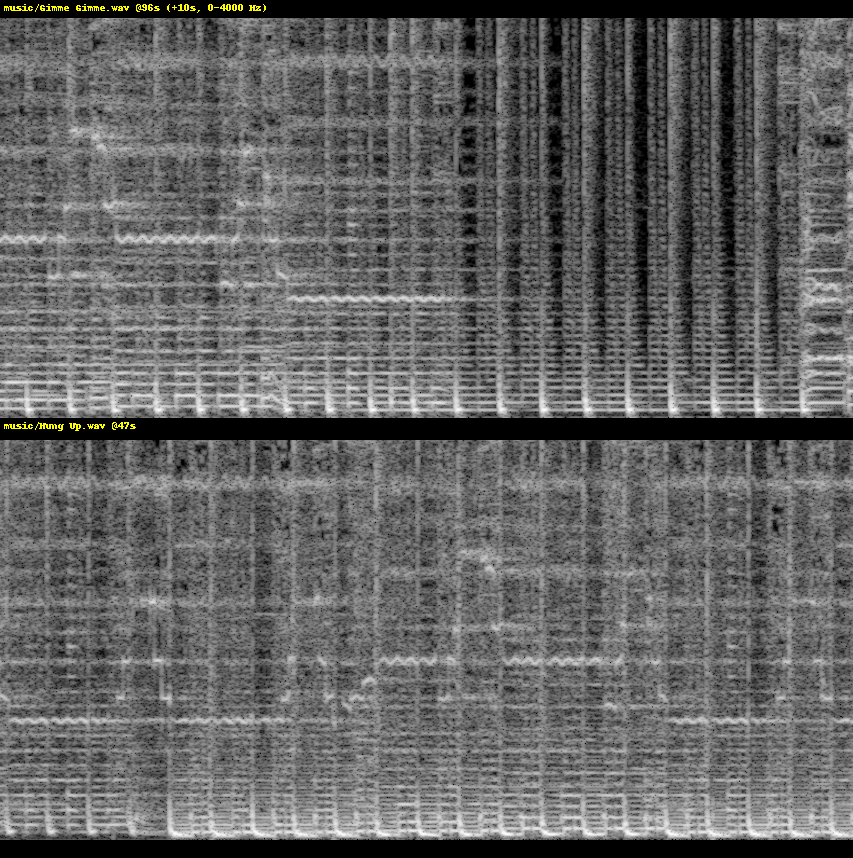
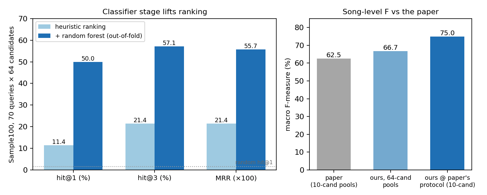
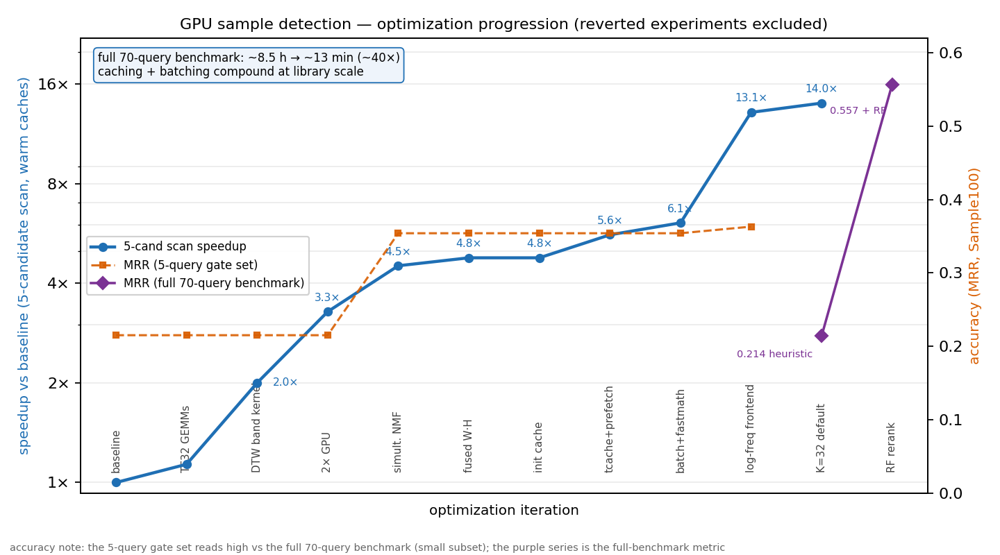
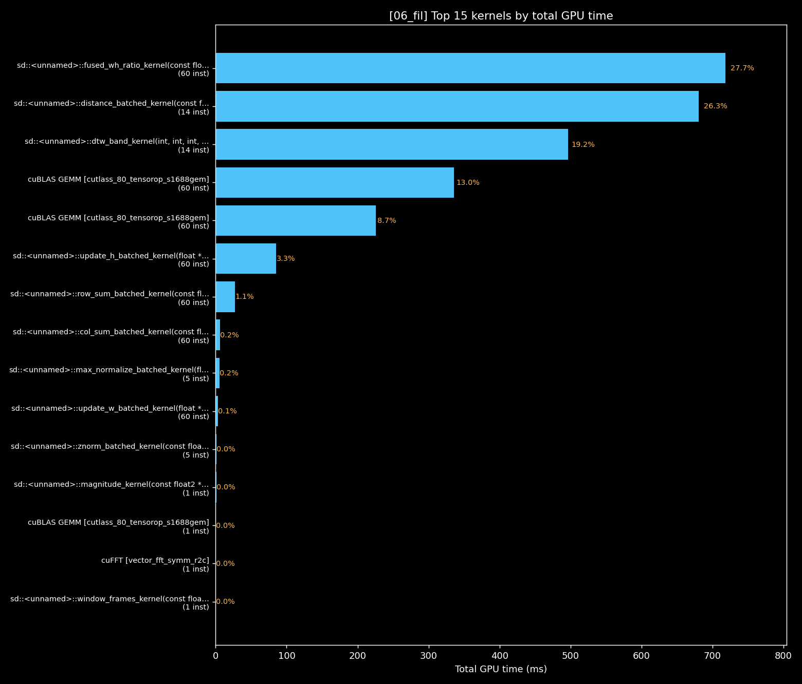
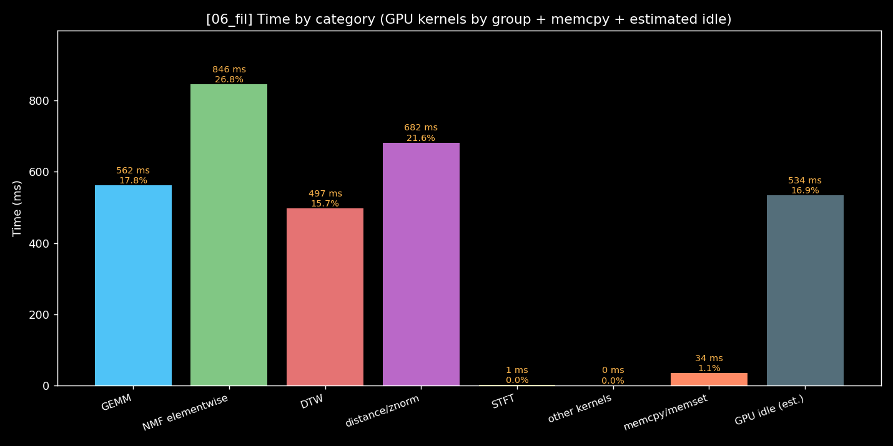
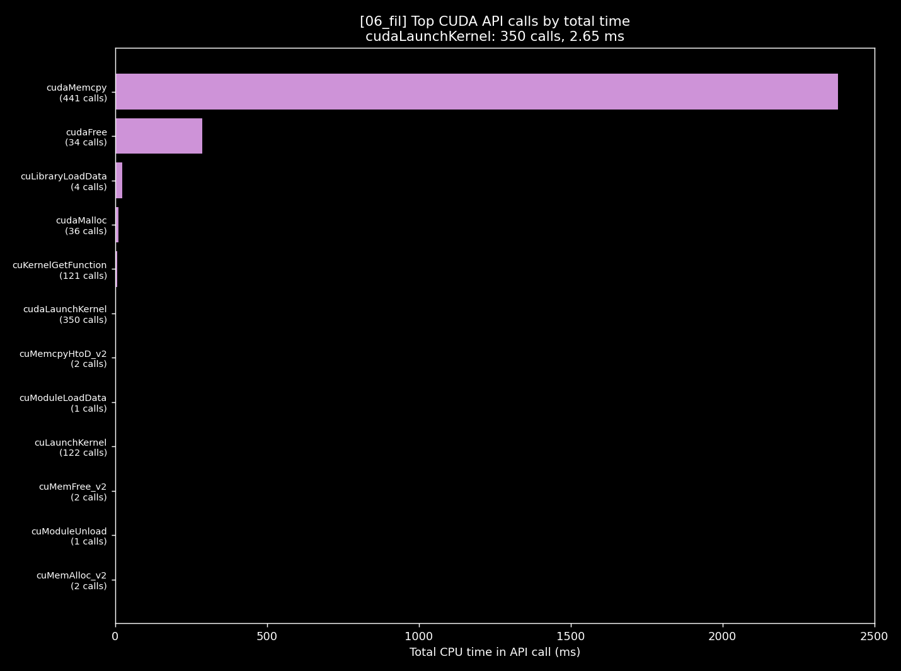

# CS 179 Final Project — Song Sample Detection in Music using GPUs
Steven Lei 2026

## Brief

This project implements the sample detection algorithm described in the paper  [Gururani & Lerch, *Automatic Sample Detection in Polyphonic Music* (ISMIR 2017)](https://archives.ismir.net/ismir2017/paper/000118.pdf). The goal is that given an input song, find the song that it potentially samples in a directory of existing songs.

In the music industry, a *sample* is a snippet of an older song that has been reused to produce a newer song. The sample could be as simple as a drum beat or as advanced as using the melody and lyrics as a sound effect. Some popular songs / artists known for sampling are Kanye West (e.g. [Touch the Sky](https://www.youtube.com/watch?v=B95OUKk7alM&list=RDB95OUKk7alM&start_radio=1) which samples [Move On Up](https://www.youtube.com/watch?v=A9RMr9KuVZo&list=RDA9RMr9KuVZo&start_radio=1)) or Madonna ([Hung Up](https://www.youtube.com/watch?v=EDwb9jOVRtU&list=RDEDwb9jOVRtU&start_radio=1) which samples [Gimme Gimme](https://www.youtube.com/watch?v=XEjLoHdbVeE&list=RDXEjLoHdbVeE&start_radio=1))

While song identification algorithms like Shazam work very well, there is currently no state of the art sample detector. This is because although samples may sound fairly obvious to a listener, they are often pitch shifted, time dilated, or altered every so slightly that computationally makes it much different than the original song it samples.

Building on Gururani and Lerch's algorithm and using the 100-song labeled Sample100 dataset, I correctly identify the sampled source as the #1 match for **50% of queries** (ranking against all 64 candidate originals — random chance is 1.6%), and reach an **F-measure of 75%** under the paper's own protocol versus their 62.5% — on a GPU pipeline that runs the entire dataset in **~13 minutes** (versus an estimated ~8.5 hours unoptimized). This successfully proves the concept of the paper.

**Please see below documentation for all information related to the project.**

Here is a table of contents that summarizes the sections

| Section | Description |
|---|---|
| Brief | Project summary and document outline |
| Repo layout | Where each part of the codebase lives |
| Usage | Build instructions and example commands |
| Evaluation | The dataset, and how to read the result metrics |
| CPU Results | CPU timing and CPU↔GPU parity |
| GPU Results | Detection accuracy and runtime on the benchmark |
| Paper → GPU Mapping | How each step of the paper's algorithm maps to GPU code |
| GPU Optimizations | The optimization campaign and performance results |
| Improvements | Remaining work and the accuracy roadmap |
| Errata | Verification, caveats, AI usage, and references |

## Repo layout

```
src/common/    audio I/O + preprocessing, shared by the CPU and GPU builds
src/cpu/       single-threaded CPU reference (matches the GPU to 4 decimals)
src/gpu/       custom CUDA kernels, cuBLAS wrappers, GPU pipeline, rf_infer
music/         song library + query songs (the demo set used in Examples)
datasets/      Sample100 evaluation set: ground-truth pairs + audio/
tests/         synthetic fixtures + the verification-ladder script
tools/         eval runner, RF train/export, pool analysis, plotting, DATASET.md
plots/         profiling outputs + the figures shown in this README
docs/          paper PDF + deep references (technical design, accuracy roadmap)
PROPOSAL.md    original proposal + timeline
CLAUDE.md      build log / operating notes
Makefile       `make` / `make clean` — thin wrapper over CMake
CMakeLists.txt, .clang-format    build configuration + Google C++ style
build/         out-of-source build output (not committed)
```


## Usage

### Pre-requisites
* CUDA toolkit (12.x) 
* CMake ≥ 3.24 
* libsndfile dev headers
*  NVIDIA GPU - this project is compiled for the Titan's architecture; developed on 2× RTX A5000

### Build

From the repository root:
```
make            # configures + builds into build/ (CMake under the hood)
make clean      # removes build/
```
### Execution
From the repository root:
```
./build/gpu_detect [flags] <query.wav> <library_dir>
./build/cpu_demo   [flags] <query.wav> <library_dir>
```

Both print the library ranked by match score (lower = better, best match
first) with the estimated pitch shift and matched locations in both songs.
The query file is skipped if it sits inside the library directory.
**`cpu_demo` is an algorithmically identical single-threaded mirror of the
GPU pipeline** — same stages, same seeded initializations.

| Flag | Binary | Meaning | Default |
|---|---|---|---|
| `--iters I` | both | NMF multiplicative-update iterations | 100 (60 is plenty) |
| `--max-seconds S` | both | truncate the query (essential for the CPU demo — full-length CPU runs take hours by design) | off |
| `--clip` | both | the query is a hand-trimmed snippet that IS the suspected sample (no surrounding song to compare against), so score by absolute alignment cost | off |
| `--gpus N` | gpu | cap the number of GPUs used | all |
| `--no-cache` | gpu | bypass the per-song candidate-template disk cache (`.tcache/`) | cache on |
| `--features F.csv` | gpu | dump the classifier's 13 path features per hypothesis instead of ranking | off |


### Examples

```bash
# One detection on the GPU — find what "Hung Up" samples in the music/ library:
./build/gpu_detect "music/Hung Up.wav" music

# The same detection on the CPU reference (slow; truncate the query to finish fast):
./build/cpu_demo --max-seconds 60 "music/Hung Up.wav" music

# Use your own library — point the second argument at any folder of .wav files:
./build/gpu_detect my_song.wav /path/to/my_library

# One query against the Sample100 originals (the 64-song benchmark library):
./build/gpu_detect datasets/sample100/audio/T001.wav datasets/sample100/library

# The entire Sample100 benchmark — every query over the whole dataset (~13 min, 2 GPUs):
python3 tools/eval_sample100.py --gpus 2 --iters 60
```

### Inspecting a match

The `cand @Xs -> query @Ys` locations printed by the detector can be checked
by eye — stacked spectrograms of the two claimed segments:

```
python3 tools/visualize_match.py "music/Gimme Gimme.wav" 96 "music/Hung Up.wav" 47 10 plots/match_example.png
```



### Reproducing the evaluation

One-time dataset setup (Sample100 audio via YouTube): `tools/DATASET.md`.
Then:

```bash
python3 tools/eval_sample100.py --gpus 2 --iters 60   # full benchmark, ~13 min
python3 tools/sweep_configs.py                        # config-matrix Pareto sweep

# classifier stage (feature corpus ~30 min on 2 GPUs, training ~40 min):
#   per query: ./build/gpu_detect --features datasets/sample100/features/<q>.csv ...
python3 tools/train_rf.py        # train + leakage-safe eval + persist OOF scores
python3 tools/pool_analysis.py   # 10-pool protocol + P/R curve (no retrain needed)
python3 tools/export_forest.py   # flat forest + verification set for the GPU kernel
./build/rf_infer plots/rf/forest.bin plots/rf/verify_rows.f32 plots/rf/verify_probs.f32 13
```

## Evaluation

**Dataset.** I evaluate on **Sample100** (Van Balen 2011), the public
benchmark for this task: a collection of songs annotated with known sample
relationships — which song sampled which, and at what timestamp. It's the
closest public stand-in for the paper's own dataset, which was never released.
After dropping a few tracks with unavailable or wrong audio (everything is
sourced from YouTube; see `tools/DATASET.md`), I use **70 query songs**, each
with exactly one true original hidden in a pool of **64 candidate originals**.

**How a run works.** Each query song is scored against all 64 candidates, and
the candidates are **ranked** best-match-first. The headline number is
**hit@1** — the fraction of the 70 queries whose true original came out ranked
#1 (random guessing would be ≈ 1.6%, i.e. 1 in 64).

**The random forest.** The raw alignment produces a single match score, but
that score alone is fooled by songs that merely *sound* similar. So, following
the paper, the final decision comes from a **random forest** — an ensemble of
200 decision trees — fed **13 features that describe the *shape* of the best
alignment** (how straight it is, how steady its tempo, how low and how uniform
its cost). Real samples produce straight, steady, low-cost alignments;
coincidental look-alikes wander. The forest learns that distinction from the
labeled dataset and re-scores every candidate; it is trained and tested with
cross-validation so it is never evaluated on a song it trained on (no data
leakage). This stage is what lifts hit@1 from 11% to 50%.

The paper frames the task as a yes/no detector rather than a ranking, scored
with the **F-measure** — so I report that too, but only where I compare
directly against the paper. Three terms:

- **Precision** — when the system declares a match, how often it is correct.
- **Recall** — of all the real samples present, how many it catches.
- **F-measure** — a single score balancing the two (their harmonic mean);
  this is the paper's headline metric.

## CPU Results

The CPU build runs the identical algorithm single-threaded, so its scores
match the GPU's to 4 decimal places (parity verified — see Errata). It is the
correctness reference and the speed baseline, not a way to run the full
benchmark: a single full-length search already takes about half a day, so the
whole dataset would take roughly a week.

| | CPU (1 thread) | GPU (2× A5000) |
|---|---:|---:|
| Accuracy | identical to GPU (below) | — |
| One search, matched config | 47.8 s | ~1 s |
| Full Sample100 benchmark | ~1 week (not run) | ~13 min |

## GPU Results

Full pipeline on the **Sample100** benchmark — 70 query songs, each ranked
against all 64 candidate originals:

| Metric | Result |
|---|---|
| **hit@1** (true original ranked #1) | **50.0%** — 11.4% without the classifier stage |
| **F-measure** | **66.7%** |
| Full benchmark runtime (2× A5000) | **~13 min** |

Under the paper's easier 10-candidate protocol, my F-measure is **75.0%**
vs the paper's **62.5%** — the concept reproduced and then some (the full
precision/recall curve and the caveats behind that comparison are in Errata).



The classifier stage is what lifts hit@1 from 11% to 50%: the ranking stage
*finds* the true sample, but sound-alike songs (simple, clean melodies that
match a bit of everything) outrank it; the 13 alignment-shape features tell
the two apart.

## Paper → GPU Mapping

A quick vocabulary, used throughout: a **spectrogram** is a song's frequency
content over time; **NMF** factorizes it as V ≈ W·H, where the columns of W
are recurring spectral patterns (the *templates* — "this chord", "this drum
hit") and the rows of H mark when each is active (the *activations*); a
**semitone** is one piano key (transposing shifts the whole spectrum by a
fixed factor). End to end, the pipeline is: preprocess → spectrogram →
factor each candidate song into templates → transpose them across 41 pitch
hypotheses → re-factor the query against those frozen templates → build a
similarity matrix → align with subsequence DTW → score → classify. An early
log-frequency pooling step shrinks each song to ≈ 5,200 frames (≈ 7.6 MB) and
cuts all downstream work ~5.6×.

Every block of the paper's pipeline (Figure 1 / §3) maps to code below.
Fidelity markers: **1:1** = faithful; **adapted** (labels D1–D6) = same block
with parameters or inputs changed; **added** (A1–A2) = not in the paper,
needed because I rank a full library without the isolated sample audio.

| Paper block | Code | Fidelity — changes & optimizations |
|---|---|---|
| Pre-processing §3.1 (downmix, RMS-normalize, 22.05 kHz) | `load_preprocessed()` — `src/common/audio.cpp` | **1:1**; hand-rolled 63-tap 2:1 decimator |
| Magnitude spectrogram (4096/1024, Hann) | `gpu_stft()`: `window_frames_kernel` + cuFFT + `magnitude_kernel` | **1:1**, plus **added (D6)** log-frequency filterbank pooling (367 bins, 4/semitone): ~5.6× less downstream compute, pitch shifts become exact integer translations |
| "Sample" NMF §3.1.1 (K=10 on the known sample) | `gpu_candidate_templates()` → `gpu_nmf_batched(P=1)` | **adapted (D1)**: no ground-truth sample, so NMF runs on the FULL candidate song with content-scaled K=32 (sweep + full-benchmark confirmed); **(D2)** unit-norm templates, norms folded into H_o; result disk-cached per song (`.tcache/`) |
| Pitch-shifted templates §3.2.2 (12 shifts) | `pitch_templates_batched_kernel` | **adapted (D3)**: 41 shifts at 0.25 st — real resample speedups land at fractional shifts and a 0.5 st miss destroys the DTW dip; on the log axis the shift is a lossless integer translation; columns re-normalized per shift (D2) |
| PFNMF §3.1 (W = [fixed sample templates \| free templates]) | `gpu_nmf_batched(P = candidates × 41)`; freezing = column mask in `update_w_batched_kernel` | **1:1** math. Optimizations: simultaneous Lee–Seung updates (3 GEMMs + 1 ratio/iter), fused W·H+ratio custom kernel (WH never materialized), TF32 strided-batched cuBLAS, cross-candidate batching (every problem is query-sized — no padding) |
| Activation normalization §3.2.1 (H/max(H)) | `max_normalize_batched_kernel` | **1:1**; all rows scaled so the fixed/free energy ratio used below is preserved |
| Distance matrix §3.2.2 (D = 1 − corr) | `znorm_batched_kernel` + `distance_batched_kernel` | **adapted (D4)**: correlation regularized (Z_REG) so near-silent frames go neutral instead of amplifying to unit noise, and weighted by PFNMF source attribution e = \|H_fix\|/(\|H_fix\|+\|H_free\|); output written diagonal-skewed so the DTW wavefront reads coalesced |
| Subsequence DTW eq. 2 (free start, cost = last row / path length) | `dtw_band_kernel` | **1:1** recurrence and boundary, run over dense 4 s candidate bands (**D5** — the sample-location search the paper doesn't need). Optimization: persistent-band kernel — one block sweeps all anti-diagonals in shared memory, slope filter + min/mean/argmin reduced in-kernel (replaced ~325k launches and ~80 GB of traffic per candidate) |
| Pitch candidate selection §3.2.3 | min over shifts, folded into scoring | **1:1**, plus **added (A1)** pitch-selectivity normalization (each band's dip ÷ its median dip across all shifts — real matches dip at ONE shift) and **added (A2)** min/median selection-bias correction (a min over ~6,500 hypotheses otherwise favors longer candidates) |
| Feature extraction §3.3 (13 path/cost features) | `dtw_band_preds_kernel` + host `backtrack_path()` → `gpu_extract_features()` (`--features`) | **1:1**: predecessor-recording DTW re-sweep of the top hypotheses, host backtracking, end points grouped by path start |
| Random forest §3.4 (200 trees, √13 features) | `tools/train_rf.py` + `forest_predict_kernel` (`src/gpu/rf_infer.cu`) | **1:1** config; trained on Sample100 (the paper's corpus was never published) with GroupKFold leakage protection; GPU inference via FIL-style packed nodes, sklearn-exact output (6e-8) |

### Summary of changes from the paper

Two changes are structural, forced by the setting: the paper starts from the
*isolated sample* and makes a yes/no call against 10 candidates, whereas I
have only full songs and *rank* all 64. So my "sample" NMF runs on the whole
candidate song with more templates, the "where is the sample" search becomes
the dense DTW band sweep (D1, D5), and ranking adds the pitch-selectivity and
hypothesis-distribution calibration the paper doesn't need (A1, A2). The rest
are accuracy refinements — a finer pitch grid, the log-frequency axis, the
regularized correlation (D3, D6, D4) — plus the GPU rewrites in the next
section. Every change had to pass the verification checks and not regress the
benchmark; several candidates (early pitch-shift pruning, a larger fused-kernel
tile, fewer NMF iterations) were tried and reverted on exactly those gates.

### Kernels

All custom kernels carry a strategy block comment in the source
(`src/gpu/kernels.cu`, `src/gpu/rf_infer.cu`):

| Kernel | Strategy (one line) |
|---|---|
| `fused_wh_ratio_kernel` | **the flagship**: W·H + division epilogue in one kernel — R ≤ 60 fits a single shared-memory tile, so WH (the largest per-iteration intermediate) is never materialized; 64×64 block tile, 4×4 per thread |
| `dtw_band_kernel` (+`_preds`) | persistent banded wavefront DP: one block per (shift, band) walks ALL anti-diagonals in shared memory over the skewed distance layout; slope filter + min/mean/argmin reduce in-kernel to 4 floats/band (replaced ~325k launches and ~80 GB of traffic per candidate) |
| `forest_predict_kernel` | FIL-style traversal: one thread per row walks 200 trees; packed 16-byte nodes = one 128-bit load per node visit (3× over SoA on the 400 MB forest) |
| `distance_batched_kernel` | thread per cell; K-dim dot of z-normalized columns = regularized 1−r; diagonal-skewed output |
| `pitch_templates_batched_kernel` | integer-translation gather on the log axis (exact); linear-interp fallback on the linear axis |
| `window_frames_kernel` / `magnitude_kernel` | STFT framing + magnitude, transposed write so NMF's transpose is free |
| `update_h/w`, `col/row_sum`, `normalize_*`, `max_normalize`, `znorm` | multiplicative updates, shared-memory tree reductions, column norms, H/max(H), regularized z-score with source attribution |

Deliberately library calls: **cuFFT** for the batched R2C STFT, and
**cuBLAS** (strided-batched, TF32 tensor cores) for the two large-k NMF
GEMMs — NMF itself exists in no NVIDIA library, and the skinny-k W·H product
where cuBLAS underperforms was replaced by the fused custom kernel (~8 TFLOPS
vs ~430 GFLOPS measured on that shape). Rationale:
`docs/gpu-library-vs-custom-kernels.md`.

## GPU Optimizations

Net effect, end to end:

| Workload (warm caches, `--iters 60`, 2 GPUs) | original | now | speedup |
|---|---:|---:|---:|
| 5-candidate full-song scan | 42.0 s | **3.0 s** | **14×** |
| full-song query vs 64-candidate library | ~340 s | **19.3 s** | **18×** |
| 15 s clip vs 64-candidate library | 21.7 s | **2.3 s** | **9.4×** |
| full 70-query benchmark | ~8.5 h (est.) | **~13 min** | **~40×** |
| forest inference (200 trees) | 0.16 M rows/s (sklearn, 32 cores) | **3.1 M rows/s** (1 GPU) | **19×** |



How I got there. Standard benchmark throughout: the 5-candidate full-song
scan (`music/`, `--iters 60`, both GPUs unless noted). Every kept change
passed the verification ladder AND an accuracy gate — accuracy *improved*
over the campaign. Per-iteration profiles in `plots/00_baseline` …
`plots/06_fil`.

| # | Optimization | Scan | What it did |
|---|---|---:|---|
| 0 | Baseline (starting implementation) | 42.0 s | DTW dominated: one kernel launch per cell of the cost matrix (~325k launches per candidate) |
| 1 | TF32 tensor-core matrix multiplies | 37.2 s | ran the NMF matrix multiplies on tensor cores; scores unchanged |
| 2 | Persistent-band DTW kernel | 21.0 s | one block sweeps a whole alignment band in shared memory instead of a launch per cell — removed ~80 GB of memory traffic per candidate; scores unchanged |
| 3 | Multi-GPU (one worker per device) | 12.8 s | candidates split across both GPUs; scores unchanged |
| 4 | Simultaneous-update NMF | 9.3 s | update both NMF factors from one shared intermediate (3 matrix multiplies + 1 elementwise pass per iteration, was 4 + 2); accuracy improved |
| — | Two-stage pitch-shift screening | — | **reverted** — pruning pitch hypotheses early hurt accuracy |
| 5 | Fused W·H + ratio kernel | 9.3 s | compute and consume the largest NMF intermediate inside one kernel, never writing it to memory; scores unchanged |
| 6 | Cached random init, fewer syncs | 8.8 s | reuse the seeded initialization across candidates; scores unchanged |
| 7 | Candidate-template disk cache | 7.5 s | each library song's templates computed once and cached on disk |
| 8 | Cross-candidate batching | 6.9 s | all candidates × 41 pitch shifts solved as one batched problem (no padding — every sub-problem is query-sized) |
| 9 | Fast-math compiler flag | ~6.9 s | approximate reciprocals/divisions; scores unchanged to 4 decimals |
| — | Larger fused-kernel tile | — | **reverted** — no measurable change |
| 10 | Log-frequency front end | 3.2 s | pool the spectrogram to 367 log-spaced bins: ~5.6× less work downstream, and pitch shifts become exact integer row-shifts; accuracy improved |
| 11 | Fewer NMF templates (K = 32, was 40) | **3.0 s** | same accuracy on the full benchmark, less work |
| 12 | Packed-node forest kernel | — | forest inference: each tree node is one 16-byte struct = one memory load per visit (3× faster); output identical to the reference |

Final-build kernel characterization (full counters and the idle decomposition
in `plots/PERF-CHARACTERIZATION.md`):

| Kernel | share of scan | SM | DRAM | occupancy | bottleneck |
|---|---:|---:|---:|---:|---|
| `fused_wh_ratio` | 27.7% | 65% | 51% | 48/50% (smem cap) | balanced; latency hidden |
| `distance_batched` | 26.3% | 59% | 6% | 92% | L1-resident (mem pipe 93%) |
| `dtw_band` | 19.2% | 72% | 54% | 95% | global-latency (wavefront) |
| cuBLAS TF32 GEMMs | 21.7% | 21–45% | 43–79% | — | bandwidth-bound; tensor pipes 32–46% = ceiling for these skinny shapes |
| `forest_predict` | (own binary) | 4% | 35% | 82% | pure latency: 452 cyc/issue dependent loads — why packed nodes won 3× |

The same profile, visualized (`plots/06_fil/`) — top kernels by GPU time, the
same time grouped by pipeline stage, and the CUDA API calls by CPU time:







Residual single-GPU idle (~17% of the now-3-second scan): 6.1% pageable H2D
staging, 3.7% one-time CUDA module load, ~6% sub-50 µs launch micro-gaps —
not synchronization, not D2H. The API view makes this concrete: the largest
CPU-side cost is `cudaMemcpy` (the blocking host→device staging), not kernel
work.

## Improvements

The substantive work is done (see the sections above); what remains is small.

Engineering:
- **Pinned staging buffers + async host→device copies** to reclaim the
  measured ~6% single-GPU idle (see GPU Optimizations).
- **Forest kernel**: walk 2–4 trees per thread to overlap the dependent-load
  latency chains — modest upside on an already-19×-sklearn kernel.
- **`--clip` mode** is implemented but its accuracy was never validated with a
  real hand-trimmed clip (it is used only in the perf benchmarks).
- Split `kernels.cu` / `cpu_pipeline.cpp` into per-stage files (cosmetic);
  promote the literal-copy verification probes into `tools/verify_pair.py`.
- Config knobs never swept: free-template count, DTW window length, faster
  NMF iteration schedules.

Accuracy (bigger, non-neural swings): a ranked roadmap of 18 ideas — synthetic
training-data augmentation for the data-starved classifier (highest-leverage),
Itakura–Saito NMF for buried samples, richer classifier features, user-marked
query snippets (`--query-window`), config ensembling, and location-level
("micro") evaluation — lives in `docs/ACCURACY-OPTIMIZATIONS.md`.

## Errata

### Correctness verification

Beyond the benchmark, four end-to-end checks with known answers guard every
change (`tests/run_ladder.sh`): (1) a song matches a copy of itself at rank 1,
zero shift; (2) 8 s of song A spliced into song B is found at the splice point
I chose; (3) the same splice sped up 6% is found at the predicted +1.0
semitone; (4) Madonna's *Hung Up* ranks ABBA's *Gimme Gimme* #1. The CPU and
GPU builds agree to 4 decimal places on all four. On the `music/` demo set the
detector also gets *Lucid Dreams* → *Shape of My Heart* right and misses
*Touch The Sky* → *Move On Up* (the true match is found but ranks #3 behind two
sound-alikes — the failure class the random forest fixes on the benchmark).

### Accuracy caveats (paper comparison)

The F-measure comparison (75% vs the paper's 62.5%, both at the 10-candidate
protocol) carries caveats: every Sample100 query has a sample, so recall is
pinned at 100% and my precision equals top-1 accuracy; run conservatively the
forest reaches 85–100% precision at 23–41% recall (`plots/pr_curve.png`). My
decoys are other much-sampled songs — more confusable than the paper's random
picks — and Sample100 skews toward short, chopped, heavily-produced samples.
Beyond hit@1: hit@3 is 57.1%, MRR 0.557.

### AI usage

Built with substantial assistance from Claude Opus 4.8 and Fable 5 (briefly) — implementation,
profiling analysis, and documentation — under continuous human direction and
review. All design decisions, the accuracy/performance gates, and final
verification were mine.

### Code quality

C++/CUDA follows the Google C++ Style Guide, enforced by the checked-in
`.clang-format` (details in `docs/STYLE.md`). The CPU and GPU pipelines are
held to 4-decimal score parity as a correctness contract, and the build is
warning-clean under `-Wall -Wextra`.

### Dataset & references

- Algorithm: Gururani & Lerch, *Automatic Sample Detection in Polyphonic
  Music*, ISMIR 2017.
- Benchmark: **Sample100** (Van Balen, 2011); audio sourced from YouTube per
  `tools/DATASET.md` (a few tracks were unavailable and excluded).

### Further reading

- `docs/TECHNICAL.md` — full design, parameters, and benchmark methodology.
- `docs/ACCURACY-OPTIMIZATIONS.md` — the 18-idea accuracy roadmap.
- `docs/gpu-library-vs-custom-kernels.md` — why cuFFT and cuBLAS are the only
  library calls.
- `CLAUDE.md` — the complete build log, with every measurement.
- `plots/PERF-CHARACTERIZATION.md` — kernel-level profiling.

