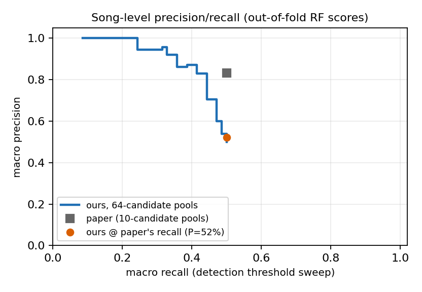

# CS 179 Final Project — GPU Sample Detection in Music

Steven Lei 2026

## Brief

This project implements **sample detection**: a *sample* is a short snippet
of an old recording reused inside a new song — usually transposed, sped
up/slowed down, and buried under new instruments. Given a song that contains
a sample, find the recording it came from in a directory of songs.
Implements [Gururani & Lerch, *Automatic Sample Detection in Polyphonic Music* (ISMIR 2017)](https://archives.ismir.net/ismir2017/paper/000118.pdf).

Those transformations defeat fingerprint matchers (Shazam-style exact
lookup), so the paper decomposes the audio instead: **NMF** factorizes each
candidate song's spectrogram into a set of spectral patterns; a
partially-fixed NMF then measures how well those patterns — tried at 41
transpositions — explain the query song; **subsequence DTW** (dynamic-
programming sequence alignment that tolerates speed differences) locates the
snippet; and a **random forest** over 13 features describing the alignment's
shape makes the final call. Every stage runs on the GPU with custom CUDA
kernels (cuFFT and cuBLAS are the two deliberate library calls), including
the forest itself. A single-threaded CPU implementation of the identical
algorithm is the correctness reference (scores match to 4 decimals).

```
$ ./build/gpu_detect --iters 60 "music/Hung Up.wav" music
...
ranking (best match first):
1. Gimme Gimme.wav              score 0.4149 (shift +0.00 st, cand @96s -> query @47s)
2. Shape of My Heart.wav        score 0.5676 (shift +2.75 st, cand @20s -> query @186s)
...
total 3.0 s (2 gpus)
```

Madonna's *Hung Up* does sample ABBA's *Gimme Gimme Gimme* — at ABBA's 1:36,
appearing at Madonna's 0:47, with no pitch shift. The scan took 3 seconds for
a five-song library (originally 42 s; the full optimization story is below).

**This file is the complete documentation.** Deep references, in rough order
of usefulness: `docs/PAPER-VS-OURS.md` (every deviation from the paper and
why), `plots/PERF-CHARACTERIZATION.md` (kernel-level profiling), `docs/TECHNICAL.md`
(design), `docs/TESTING.md` (test definitions), `docs/ACCURACY-OPTIMIZATIONS.md`
(future-work roadmap), `CLAUDE.md` (full build log with every measurement).

## Build

Requires: CUDA toolkit (12.x), CMake ≥ 3.24, libsndfile dev headers, and an
NVIDIA GPU (compiled for the host's architecture; developed on 2× RTX A5000,
sm_86 — a second GPU is used automatically when present). No other
dependencies.

```
make            # configures + builds into build/ (CMake under the hood)
make clean      # removes build/
```

## Usage

```
./build/gpu_detect [flags] <query.wav> <library_dir>
./build/cpu_demo   [flags] <query.wav> <library_dir>
```

Both print the library ranked by match score (lower = better, best match
first) with the estimated pitch shift and matched locations in both songs.
The query file is skipped if it sits inside the library directory.
**`cpu_demo` is an algorithmically identical single-threaded mirror of the
GPU pipeline** — same stages, same seeded initializations.

| Flag | Binary | Meaning | Default |
|---|---|---|---|
| `--iters I` | both | NMF multiplicative-update iterations | 100 (60 is plenty) |
| `--max-seconds S` | both | truncate the query (essential for the CPU demo — full-length CPU runs take hours by design) | off |
| `--clip` | both | the query is a hand-trimmed snippet that IS the suspected sample (no surrounding song to compare against), so score by absolute alignment cost | off |
| `--gpus N` | gpu | cap the number of GPUs used | all |
| `--no-cache` | gpu | bypass the per-song candidate-template disk cache (`.tcache/`) | cache on |
| `--features F.csv` | gpu | dump the classifier's 13 path features per hypothesis instead of ranking | off |

### Inspecting a match

The `cand @Xs -> query @Ys` locations printed by the detector can be checked
by eye — stacked spectrograms of the two claimed segments:

```
python3 tools/visualize_match.py "music/Gimme Gimme.wav" 96 "music/Hung Up.wav" 47 10 plots/match_example.png
```


### Reproducing the evaluation

One-time dataset setup (Sample100 audio via YouTube): `tools/DATASET.md`.
Then:

```bash
python3 tools/eval_sample100.py --gpus 2 --iters 60   # full benchmark, ~13 min
python3 tools/sweep_configs.py                        # config-matrix Pareto sweep

# classifier stage (feature corpus ~30 min on 2 GPUs, training ~40 min):
#   per query: ./build/gpu_detect --features datasets/sample100/features/<q>.csv ...
python3 tools/train_rf.py        # train + leakage-safe eval + persist OOF scores
python3 tools/pool_analysis.py   # 10-pool protocol + P/R curve (no retrain needed)
python3 tools/export_forest.py   # flat forest + verification set for the GPU kernel
./build/rf_infer plots/rf/forest.bin plots/rf/verify_rows.f32 plots/rf/verify_probs.f32 13
```

## Test

There are five checks. The first four are end-to-end detections whose
correct answer is known in advance; `tests/run_ladder.sh` runs them (every
change in this project's history had to keep them passing). In plain words:

1. **Identity** — query a song against a copy of itself. Must match at
   rank 1, zero pitch shift, aligned positions.
2. **Planted sample** — paste 8 s of song A into the middle of song B
   (done with ffmpeg by `tests/make_fixtures.sh`), then ask the detector to
   find A inside B. Must report the splice point and zero shift — we know
   both exactly, because we did the splicing.
3. **Planted sample, sped up 6%** — speeding audio up raises its pitch by a
   predictable amount (12·log₂(1.06) ≈ +1.01 semitones; a semitone = one
   piano key). The detector must report that shift — a value predicted by
   theory, not tuned for.
4. **Real-world pair** — Madonna's *Hung Up* famously samples ABBA's
   *Gimme Gimme Gimme*; it must rank #1 in a real library.

| # | Check | Result (final build, lower score = better) |
|---|---|---|
| 1 | identity | **pass** — rank 1, 0.171 @ +0.00 st |
| 2 | planted sample | **pass** — 0.421 @ +0.00 st, splice point exact |
| 3 | planted, +6% speed | **pass** — 0.346 @ **+1.00 st** (predicted +1.01) |
| 4 | Hung Up → Gimme Gimme | **pass** — rank 1, 0.415 vs 0.568 runner-up |

5. **CPU ↔ GPU agreement** — the CPU implementation runs the same algorithm
with the same random seeds, so on the checks above its scores must match the
GPU's to 4 decimal places. They do, despite TF32 tensor cores and
`--use_fast_math` on the GPU side. The same runs give the timing contrast:

| Canary config (30 s query, 30 iters, 1 candidate) | time |
|---|---:|
| `cpu_demo` (single thread) | 47.8 s |
| `gpu_detect` (1 GPU) | ~1 s |
| historical v1 measurement (45 s query, matched config) | CPU 149 s vs GPU 2.2 s = **68×** |

A full-config CPU library scan extrapolates to hours — by design, not run.

## Results

### Sample100 benchmark

The real evaluation is **Sample100** (Van Balen 2011), the public standard
benchmark for this task: 70 hip-hop songs with a known sample each, ranked
against all **64** originals in the set (the paper's own dataset was never
published; protocol differences are noted below). Metrics: **hit@k** = the
true original ranked in the top k; **MRR** = mean of 1/rank (1.0 = always
first; random guessing ≈ 0.07 here). The random-forest stage is evaluated
without data leakage: grouped cross-validation, predictions only from folds
that never saw the query, thresholds chosen on training data.

| Sample100, 70 queries × 64 candidates | DTW score alone | + random forest |
|---|---:|---:|
| hit@1 | 11.4% | **50.0%** |
| hit@3 | 21.4% | **57.1%** |
| MRR | 0.214 | **0.557** |
| song-level precision / recall / F | — (no threshold) | **50.0 / 100.0 / 66.7%** |


Why the forest matters so much: the DTW stage *finds* the true sample
(correct shift, correct location) but gets outranked by songs that merely
*sound similar* — candidates with simple, clean melodies match a little bit
of everything. The 13 features describing the alignment's shape separate the
two, exactly as the paper claims: a real sample aligns along a straight,
full-length, low-cost path; a coincidental resemblance wanders. The trained
forest's feature importances rank path shape highest (avg_slope 0.130,
avg_cost 0.107, min_cost 0.100), independently confirming that thesis.

### Apples-to-apples with the paper

The paper picks the sample's source out of **10** candidates (1 true +
9 random); we rank against **64** — ~6× harder by chance alone. To compare
fairly, we replay the paper's exact setup using our cross-validation scores
(`tools/pool_analysis.py`: top-1 computed exactly, precision/recall by
simulation):

| | Paper | Ours, 64-pool | Ours @ paper's protocol (10-pool) |
|---|---:|---:|---:|
| Precision | 83.3% | 50.0% | **60.4%** |
| Recall | 50.0% | 100.0% | **99.0%** |
| F-measure | 62.5% | 66.7% | **75.0%** |
| Top-1 accuracy | — | 50.0% | **60.3%** |



Honest caveats before citing these:

- **Different operating points**: the paper's 83.3% precision came at 50%
  recall — their threshold declines to answer half the queries. Ours answers
  every query (every Sample100 query *has* a sample, so abstaining is never
  rewarded), making our precision equal top-1 accuracy. Run conservatively,
  our forest reaches 85–100% precision at 23–41% recall, and 52.2% at the
  paper's exact 50%-recall point (curve above).
- **Different negatives**: even at matched pool size, our "random" decoys
  are other much-sampled songs from the same genres — far more confusable
  than the paper's random picks likely were.
- **Different datasets**: their 80-pair corpus is unpublished; Sample100
  skews hard (short, chopped, heavily produced samples).

### Real-pair anecdotes (`music/`, DTW score alone — no forest)

| Pair | Result |
|---|---|
| *Hung Up* → *Gimme Gimme* | **pass, decisive** (0.415 vs 0.568) |
| *Lucid Dreams* → *Shape of My Heart* | **pass** (rank #1 at 0.583; reported position differs from the known alignment) |
| *Touch The Sky* → *Move On Up* | **fail** — the true alignment is found but ranks #3 behind two sound-alikes: exactly the failure class the forest fixes on the benchmark |

### Performance

| Workload (warm caches, `--iters 60`, 2 GPUs) | original | now | speedup |
|---|---:|---:|---:|
| 5-candidate full-song library scan | 42.0 s | **3.0 s** | **14×** |
| full-song query vs 64-candidate library | ~340 s | **19.3 s** | **18×** |
| 15 s clip vs 64-candidate library | 21.7 s | **2.3 s** | **9.4×** |
| full 70-query Sample100 benchmark | ~8.5 h (est.) | **~13 min** | **~40×** |
| forest inference (200 trees) | 0.16 M rows/s (sklearn, 32 cores) | **3.1 M rows/s** (1 GPU) | **19×** |


## Implementation details

### Pipeline (with sizes)

Vocabulary, once: a **spectrogram** V is frequency content over time
(columns = ~46 ms time frames); NMF factorizes V ≈ W·H where the columns of
**W** are recurring spectral patterns ("this chord", "this drum hit" — the
*templates*) and the rows of **H** say when each pattern is active (the
*activations*). A **semitone (st)** is one piano key; transposing a sample
shifts its whole spectrum by a fixed factor. Sizes below are for a ~4-minute
song (22.05 kHz, FFT 4096, hop 1024, ~21.5 frames/s ≈ 5200 frames):

1. **Preprocess + spectrogram** (both songs): downmix, normalize, decimate
   2:1; 2049-bin FFT magnitudes pooled onto a **log-frequency axis**
   (4 bins/semitone → 367 bins, one GEMM). Two wins: ~5.6× less compute
   everywhere downstream, and a pitch shift becomes an **exact integer
   row-translation** of a template. V ∈ ℝ^(367×~5200) ≈ 7.6 MB float.
2. **Candidate NMF**: factorize the *full* candidate song into K=32
   templates (the paper uses K=10 on the isolated sample, which we don't
   have; K=32 chosen by sweep + full-benchmark confirmation). Cached per
   library song (`.tcache/`, fingerprint-keyed).
3. **Transposed template bank**: each template translated by p·4 rows for 41
   hypotheses (−5..+5 st in 0.25 st steps — finer than the paper's 12,
   because real-world speed changes land at fractional shifts).
4. **Partially-fixed NMF on the query**: W = [candidate's templates, frozen |
   20 free templates]; the free ones absorb everything in the query that
   isn't the candidate, so the frozen activations indicate *presence*.
   All 41 shifts × all candidates solve as **one strided-batched problem**
   (every problem is query-sized — candidate length never enters — so
   candidates batch without padding).
5. **Distance matrix** per shift: how similar is the candidate's activation
   pattern at time i to the query's at time j (regularized correlation,
   §3.2.1–3.2.2), written **diagonal-skewed** so the DTW wavefront reads
   coalesced; chunked over shifts under a 4 GB budget.
6. **Banded subsequence DTW**: the paper's alignment recurrence (eq. 2), run
   over every 4 s window of the candidate (1 s step) — each window is a
   "maybe the sample is here" hypothesis, and they all reuse the same
   distance matrix.
7. **Scoring**: a true match shows up as a sharp *local minimum* in
   alignment cost at exactly ONE shift; coincidental similarity is mildly
   cheap everywhere. Score = depth of the best minimum, normalized by that
   window's median across shifts and by the candidate's own hypothesis
   distribution, with implausibly-warped paths rejected (§3.3.2).
8. **Classifier stage (§3.3–3.4)**: for the top hypotheses, DTW re-runs with
   predecessor recording, the alignment paths are backtracked, and the
   paper's 13 path-shape features feed a 200-tree random forest (trained on
   Sample100, leakage-safe). GPU inference via a FIL-style kernel whose
   output matches sklearn to 6e-8.

### Paper ↔ code mapping

Every block of the paper's pipeline (Figure 1 / §3) exists in code. Fidelity
markers: **1:1** = faithful implementation; **adapted** = same block, inputs
or parameters changed (labels D1–D6); **added** = block not in the paper
(A1–A2, needed because we rank a full library without ground-truth sample
audio). The full narrative of every deviation is `docs/PAPER-VS-OURS.md`.

| Paper block | Code | Fidelity — changes & optimizations |
|---|---|---|
| Pre-processing §3.1 (downmix, RMS-normalize, 22.05 kHz) | `load_preprocessed()` — `src/common/audio.cpp` | **1:1**; hand-rolled 63-tap 2:1 decimator |
| Magnitude spectrogram (4096/1024, Hann) | `gpu_stft()`: `window_frames_kernel` + cuFFT + `magnitude_kernel` | **1:1**, plus **added (D6)** log-frequency filterbank pooling (367 bins, 4/semitone): ~5.6× less downstream compute, pitch shifts become exact integer translations |
| "Sample" NMF §3.1.1 (K=10 on the known sample) | `gpu_candidate_templates()` → `gpu_nmf_batched(P=1)` | **adapted (D1)**: no ground-truth sample, so NMF runs on the FULL candidate song with content-scaled K=32 (sweep + full-benchmark confirmed); **(D2)** unit-norm templates, norms folded into H_o; result disk-cached per song (`.tcache/`) |
| Pitch-shifted templates §3.2.2 (12 shifts) | `pitch_templates_batched_kernel` | **adapted (D3)**: 41 shifts at 0.25 st — real resample speedups land at fractional shifts and a 0.5 st miss destroys the DTW dip; on the log axis the shift is a lossless integer translation; columns re-normalized per shift (D2) |
| PFNMF §3.1 (W = [fixed sample templates \| free templates]) | `gpu_nmf_batched(P = candidates × 41)`; freezing = column mask in `update_w_batched_kernel` | **1:1** math. Optimizations: simultaneous Lee–Seung updates (3 GEMMs + 1 ratio/iter), fused W·H+ratio custom kernel (WH never materialized), TF32 strided-batched cuBLAS, cross-candidate batching (every problem is query-sized — no padding) |
| Activation normalization §3.2.1 (H/max(H)) | `max_normalize_batched_kernel` | **1:1**; all rows scaled so the fixed/free energy ratio used below is preserved |
| Distance matrix §3.2.2 (D = 1 − corr) | `znorm_batched_kernel` + `distance_batched_kernel` | **adapted (D4)**: correlation regularized (Z_REG) so near-silent frames go neutral instead of amplifying to unit noise, and weighted by PFNMF source attribution e = \|H_fix\|/(\|H_fix\|+\|H_free\|); output written diagonal-skewed so the DTW wavefront reads coalesced |
| Subsequence DTW eq. 2 (free start, cost = last row / path length) | `dtw_band_kernel` | **1:1** recurrence and boundary, run over dense 4 s candidate bands (**D5** — the sample-location search the paper doesn't need). Optimization: persistent-band kernel — one block sweeps all anti-diagonals in shared memory, slope filter + min/mean/argmin reduced in-kernel (replaced ~325k launches and ~80 GB of traffic per candidate) |
| Pitch candidate selection §3.2.3 | min over shifts, folded into scoring | **1:1**, plus **added (A1)** pitch-selectivity normalization (each band's dip ÷ its median dip across all shifts — real matches dip at ONE shift) and **added (A2)** min/median selection-bias correction (a min over ~6,500 hypotheses otherwise favors longer candidates) |
| Feature extraction §3.3 (13 path/cost features) | `dtw_band_preds_kernel` + host `backtrack_path()` → `gpu_extract_features()` (`--features`) | **1:1**: predecessor-recording DTW re-sweep of the top hypotheses, host backtracking, end points grouped by path start |
| Random forest §3.4 (200 trees, √13 features) | `tools/train_rf.py` + `forest_predict_kernel` (`src/gpu/rf_infer.cu`) | **1:1** config; trained on Sample100 (the paper's corpus was never published) with GroupKFold leakage protection; GPU inference via FIL-style packed nodes, sklearn-exact output (6e-8) |

The full narrative of accuracy and performance decisions — including
everything tried and reverted — is `docs/PAPER-VS-OURS.md`.

### Kernels

All custom kernels carry a strategy block comment in the source
(`src/gpu/kernels.cu`, `src/gpu/rf_infer.cu`):

| Kernel | Strategy (one line) |
|---|---|
| `fused_wh_ratio_kernel` | **the flagship**: W·H + division epilogue in one kernel — R ≤ 60 fits a single shared-memory tile, so WH (the largest per-iteration intermediate) is never materialized; 64×64 block tile, 4×4 per thread |
| `dtw_band_kernel` (+`_preds`) | persistent banded wavefront DP: one block per (shift, band) walks ALL anti-diagonals in shared memory over the skewed distance layout; slope filter + min/mean/argmin reduce in-kernel to 4 floats/band (replaced ~325k launches and ~80 GB of traffic per candidate) |
| `forest_predict_kernel` | FIL-style traversal: one thread per row walks 200 trees; packed 16-byte nodes = one 128-bit load per node visit (3× over SoA on the 400 MB forest) |
| `distance_batched_kernel` | thread per cell; K-dim dot of z-normalized columns = regularized 1−r; diagonal-skewed output |
| `pitch_templates_batched_kernel` | integer-translation gather on the log axis (exact); linear-interp fallback on the linear axis |
| `window_frames_kernel` / `magnitude_kernel` | STFT framing + magnitude, transposed write so NMF's transpose is free |
| `update_h/w`, `col/row_sum`, `normalize_*`, `max_normalize`, `znorm` | multiplicative updates, shared-memory tree reductions, column norms, H/max(H), regularized z-score with source attribution |

Deliberately library calls: **cuFFT** for the batched R2C STFT, and
**cuBLAS** (strided-batched, TF32 tensor cores) for the two large-k NMF
GEMMs — NMF itself exists in no NVIDIA library, and the skinny-k W·H product
where cuBLAS underperforms was replaced by the fused custom kernel (~8 TFLOPS
vs ~430 GFLOPS measured on that shape). Rationale:
`docs/gpu-library-vs-custom-kernels.md`.

### Optimization campaign

Standard benchmark throughout: the 5-candidate full-song scan (`music/`,
`--iters 60`, both GPUs unless noted). Every kept change passed the
verification ladder AND an accuracy gate — accuracy *improved* over the
campaign. Per-iteration profiles in `plots/00_baseline` … `plots/06_fil`.

| # | Change | Scan | Note |
|---|---|---:|---|
| 0 | v3 algorithm, pre-optimization | 42.0 s | baseline; DTW = 33.6% of wall, ~325k launches/candidate |
| 1 | TF32 tensor-core GEMMs | 37.2 s | scores drift ≤1e-4 |
| 2 | Persistent-band DTW kernel over diagonal-skewed distances | 21.0 s | bit-identical; killed ~80 GB traffic + 600 MB D2H per candidate |
| 3 | Multi-GPU (worker per device, shared queue) | 12.8 s | bit-identical |
| 4 | Simultaneous-update NMF (3 GEMMs + 1 ratio/iter, was 4+2) | 9.3 s | *improved* eval ranks (gate MRR 0.215 → 0.354) |
| — | Two-stage shift screening (15/8, then 25/16) | — | **reverted**: accuracy gate failed both times |
| 5 | Fused custom W·H+ratio kernel (WH never materialized) | 9.3 s | bit-identical; single-GPU 14.1 → 10.6 s |
| 6 | Host-init cache + sync removal + longest-first queue | 8.8 s | byte-identical |
| 7 | Candidate-template disk cache + decode prefetch | 7.5 s | clip search 21.7 → 7.9 s |
| 8 | Cross-candidate PFNMF batching + persistent scratch | 6.9 s | fixed two scheduling bugs found by measurement |
| 9 | `--use_fast_math` | ~6.9 s | scores identical to 4 decimals |
| — | 128×64 fused tile (Boehm-style) | — | **reverted**: measured neutral (H slabs already L2-resident) |
| 10 | Log-frequency front end (367 bins, exact-translation shifts) | 3.2 s | gate MRR 0.354 → 0.363 |
| 11 | K=32 default (sweep + full-benchmark confirmation) | **3.0 s** | benchmark MRR 0.214 vs 0.203 at K=40 |
| 12 | FIL forest kernel: packed 16-byte nodes | — | 1.0 → 3.1 M rows/s; sklearn-exact |

Final-build kernel characterization (ncu/nsys; full counters and the idle
decomposition in `plots/PERF-CHARACTERIZATION.md`):

| Kernel | share of scan | SM | DRAM | occupancy | bottleneck |
|---|---:|---:|---:|---:|---|
| `fused_wh_ratio` | 27.7% | 65% | 51% | 48/50% (smem cap) | balanced; latency hidden |
| `distance_batched` | 26.3% | 59% | 6% | 92% | L1-resident (mem pipe 93%) |
| `dtw_band` | 19.2% | 72% | 54% | 95% | global-latency (wavefront) |
| cuBLAS TF32 GEMMs | 21.7% | 21–45% | 43–79% | — | bandwidth-bound; tensor pipes 32–46% = ceiling for these skinny shapes |
| `forest_predict` | (own binary) | 4% | 35% | 82% | pure latency: 452 cyc/issue dependent loads — why packed nodes won 3× |

Residual single-GPU idle (~17% of the now-3-second scan): 6.1% pageable H2D
staging, 3.7% one-time CUDA module load, ~6% sub-50 µs launch micro-gaps —
not synchronization, not D2H.

## Improvements

Remaining items are small (full list: `TODO.md`; future accuracy roadmap
with 18 ranked ideas: `docs/ACCURACY-OPTIMIZATIONS.md`). Headlines:

- pinned staging buffers + async H2D for the measured 6.1% idle;
- forest kernel: interleave 2–4 trees per thread to overlap latency chains;
- synthetic training-data augmentation for the RF — the highest-leverage
  accuracy idea (the classifier is data-starved: 0.30% positive rate);
- user-marked query snippets (`--query-window`) and multiple DTW band
  lengths;
- location-level ("micro") evaluation per the paper.

## Repo layout

```
src/common/   audio I/O + shared types/params        PROPOSAL.md   proposal + timeline
src/cpu/      CPU reference (4-decimal GPU parity)   docs/         paper + deep references
src/gpu/      custom kernels + cuBLAS wrappers       TODO.md       remaining small items
              + GPU pipeline + rf_infer              CLAUDE.md     operating notes + build log
music/        song library                           build/        out-of-source build dir
tests/        fixtures + verification ladder
tools/        eval runner, RF trainer/exporter, pool analysis, sweep, plots, DATASET.md
datasets/     sample100/ evaluation set (eval_pairs.csv ground truth + audio/)
```
